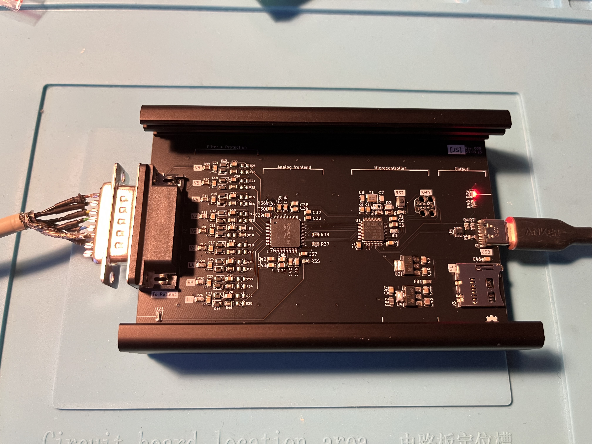
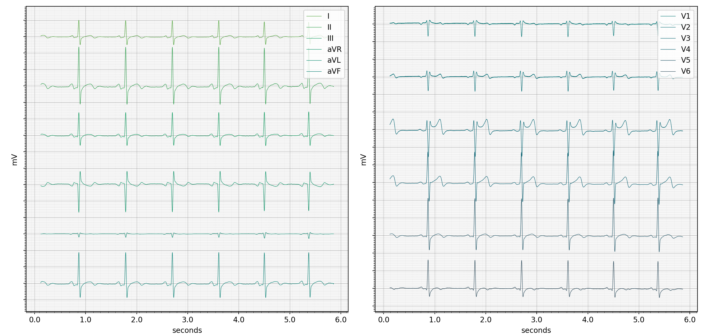

# SimpleECG

This is a USB powered electrocardiograph, which streams the data straight to a computer. Currently it's a barebones version with just some basic protection.

It's a showcase of how easy it is to build your own "medical grade" ECG for ~50$ and should serve you as a starting point if you want to design and build your own. Also, I just really wanted to have an ECG...

**Some key data points:**

- ADS1298 analog frontend
- STM32F103 microprocessor
- USB power and data
- basic filtering and protection between patient and device, but no galvanic isolation between USB power source and PCB
- currently up to 2000 samples per second (limited by SPI speed, can be improved)

## Example Data

## Disclaimer
Don't actually use this in a clinical setting, it is a hobby project and lacks a lot of mandatory safety features for medical devices. For safety reasons I advise only connecting it to a battery powered laptop, which is not connected to an outlet.